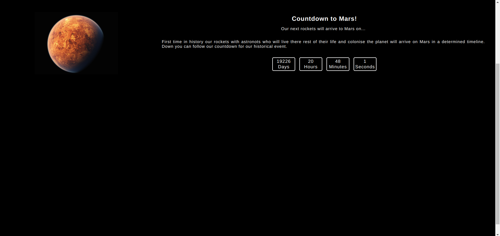

# COUNTDOWN PROJECT

## FRONTEND PRACTICE PROJECT NO: 12

1. I used Javascript, Jquery, HTML, CSS to practice my skills.

2. It is a countdown for a future date including days, hours, minutes and seconds and refreshes every second.

3. I used mathematical formulas for this project and Date().
